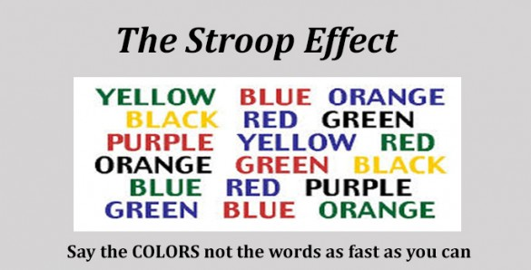

```{r setup, include=FALSE}
knitr::opts_chunk$set(echo = TRUE)
library(ggplot2)
library(psych)
library(dplyr)
library(tidyr)
```


## Background Information

In a Stroop task, participants are presented with a list of words, with each word displayed in a color of ink. The participant’s task is to say out loud the color of the ink in which the word is printed. The task has two conditions: a congruent words condition, and an incongruent words condition. In the congruent words condition, the words being displayed are color words whose names match the colors in which they are printed: for example <span style="color:red">RED</span> , <span style="color:blue">BLUE</span>. In the incongruent words condition, the words displayed are color words whose names do not match the colors in which they are printed: for example <span style="color:green">PURPLE</span>, <span style="color:purple">ORANGE</span>. In each case, we measure the time it takes to name the ink colors in equally-sized lists. Each participant will go through and record a time from each condition. 

## Questions For Investigation

1. What is our independent variable? What is our dependent variable?

-The independent variable: The condition of words as either congruent or incongruent.

-The dependent variable: The allocated time for a participant to read out the color of the listed words.

2. What is an appropriate set of hypotheses for this task? What kind of statistical test do you expect to perform? Justify your choices.

The appropriate set of hypotheses is as follows: 

Note: **c** refers to Congruent words, and **i** refers to Incongruent Words, where μ corresponds to the population mean.

**Null Hypothesis: μc ≥ μi**  There is no significant difference in the mean time needed to read out congruent and incongruent words.

**Alternative Hypothesis: μc < μi**  There is a significant difference in which less mean time is needed to read out the congruent words than the incongruent ones.

Since this case resembles a repeated measure design on the same subject, and the fact that population parameters are unknown (population's mean and standard deviation), and we only have a small sample ( n < 30 ), we cannot apply z-test. Instead, the appropriate statistical test to perform is a one-tailed depended sample t-test. 

A depended sample t-tests assumes the following : (<a href="http://www.psychology.emory.edu/clinical/bliwise/Tutorials/TOM/meanstests/assump.htm">Source</a>)

  - Interval or ratio scale of measurement (approximately interval).

  - Random sampling from a defined population.

  - Samples or sets of data used to produce the difference scores are linked in the population through repeated measurement, natural association, or matching.

  - Scores are normally distributed in the population; difference scores are normally distributed.

## Descriptive Statistics & Visualizations
  
3. Report some descriptive statistics regarding this dataset. Include at least one measure of central tendency and at least one measure of variability.

```{r}
stroopdata <- read.csv('stroopdata.csv') #read data as csv
reshaped_stroop <- gather(stroopdata, "Condition", "Time",1:2) #reshape the dataset

#fixed2 <- stroopdata %>% gather(Condition, Time, Congruent, Incongruent)
#stroopdata$Subject <- seq(1,24,1) #add a subject number for each observation

describe (stroopdata %>% select(Congruent,Incongruent)) #descriptive statistics for Congruent,Incongruent variables.
```

Provide one or two visualizations that show the distribution of the sample data. Write one or two sentences noting what you observe about the plot or plots.

```{r}
ggplot(aes(x = Condition), data = reshaped_stroop) +
 geom_boxplot(aes(y = Time, fill= Condition))+
  ylab('Completion Time in Seconds') +
  xlab('Congruity Condition') +
  ggtitle("Boxplot: Completion Time for each Congruity Condition")   

ggplot(reshaped_stroop, aes(Time, fill = Condition)) + 
  geom_histogram(binwidth = 2,alpha = 0.6, position = 'identity',color = 'red')+
  scale_x_continuous(breaks=seq(7,37,2)) +coord_cartesian(xlim = c(8, 37)) +
  ggtitle("Boxplot: Congruity") +
  xlab('Completion Time in Seconds') +
  ylab('Frequency') +
  ggtitle("Histogram: Completion Time for each Congruity Condition")

```

The above boxplot fundamentally shows how notable the difference is between the median/mean under the effect of incongruent words conditions against the congruent words condition. The histogram depicts a similar view but highlights the overlapping instances between the two conditions (around 15 - 23 seconds). In both visualization, the outliers in the incongruent conditions are clearly positioned far away which may affect the mean to some extent.

## Statistical Decision

Now, perform the statistical test and report your results. What is your confidence level and your critical statistic value? Do you reject the null hypothesis or fail to reject it? Come to a conclusion in terms of the experiment task. Did the results match up with your expectations?

Confidence level = 95% (α = 0.05)

t-critical value  = -1.714

Degree of Freedom = 23

```{r}
t.test(
  stroopdata$Congruent, stroopdata$Incongruent, paired = TRUE,
  alternative = "less", var.equal = FALSE
)
```

Since the t-static value is -7.96 which lies under the t-critical value -1.714 and the p-value is less than 0.001, we reject the null hypothesis in favor for the alternative. So we can say that there is a significant difference in the mean task completion times between conditions and it takes significantly less to complete the congruent-condition task than the incongruent-condition task. Such statistics results do match with our intuitive at the beginning of reading about the Stroop Effect, incongruent words typically demand much higher mental & vision focus and less trivial than the congruent words. 

