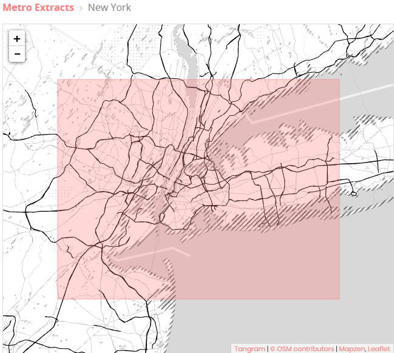
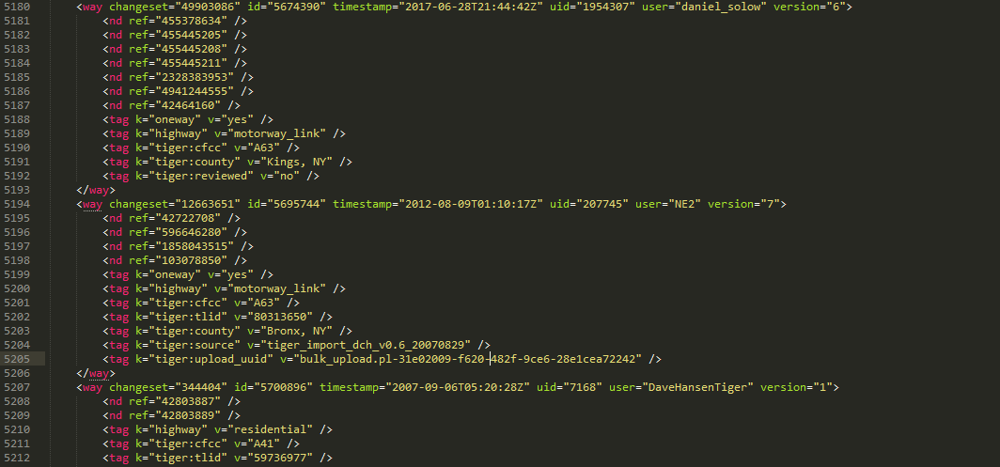
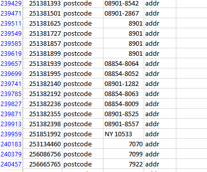
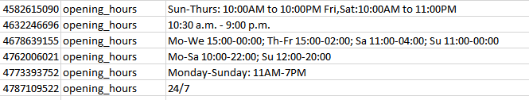

# OpenStreetMap Data Wrangling Project
**Author: [Abdulaziz Alhaqbani]**


### Map Area: New York City, NY, United States.

I only have been once to NY when I was 9 years old, but since then, the scenery of being surrounded by iconic skyscrapers especially the Empire State & the Statue of Liberty has been always in my mind. I am pleased to start virtually wrangling the streets of NY as sign of admiration to this beautiful city.



The dataset was extracted from Mapzen [Here](https://mapzen.com/data/metro-extracts/metro/new-york_new-york/) as raw OSM XML file.

#### Sample from the NewYork's XML File:



- Size before Compression: 155 MB
- Size After Compression: 2.6 GB 

## Problems Encountered:
### Inconsistent & Overabbreviated Street Names:
The streets names in both **nodes_tags** and **ways_tags** had variant formatting conventions for naming streets such as:

    NEW ENGLAND AVE
    COLLEGE AVENUE
    Ashley Cir
    Apollo Circle


In addition, other street names seemed to combine double abbreviations or even special characters like ‘#’ or ‘%’:

     6th St
     Joralemon Street, #4CF
     
Therefore, I decided to create a mapping dictionary to enforce a unified convention with the use of Regular Expression to extract the last name in the street.


```python
mapping = { "St": "Street",
            "St.": "Street",
            "st" : "Street",
            "Blvd": "Boulevard",
            "Ave.": "Avenue",
            "Ave": "Avenue",
            "AVE": "Avenue",
            "Rd.": "Road",
            "Rd": "Road",
            "PKWY": "Parkway",
            "Pkwy": "Parkway",
            "Ln": "Lane",
            "CT": "Court",
            "Ct": "Court",
            "Cir": "Circle",
            "Cres": "Crescent",
            "Ter": "Terrace",
            "DRIVE": "Drive",
            "STREET": "Street"
            }
```


```python
def is_street_name(elem): #check if the tag is related to streets/addresses
    return (elem.attrib['k'] == "addr:street")


def update_street_name(name):  
    if street_type_re.search(name):# if the regular expression is met then it is True
        try:
            #True means the street name looks fine.
            if street_type_re.search(name).group() not in mapping.keys(): 
                return fix_digitized_street(name) 
            else:
                #extract the street name that needs to be mapped.
                street_typo = street_type_re.search(name).group()
                #mapping with the dictionary above.
                fixed_street = name.replace(street_typo,mapping.get(street_typo)) 
                return fix_digitized_street(fixed_street)
        except:
            return name
```

The method **fix_digitized_street** will ensure to replace (1st, 2nd ,3rd …10th ) to (First, Second, Third ..Tenth) in order to keep consistency between all street names.


```python
def fix_digitized_street(street):  
    #Regular Expressio to search for 1st, 2nd ....
    digitized_street_re = re.compile("\\((?:1ST|2ND|3RD|4TH|5TH|6TH|7TH|8TH|9TH|10TH)\\)| \
                                     \\b(?:1ST|2ND|3RD|4TH|5TH|6TH|7TH|8TH|9TH|10TH)\\b", re.IGNORECASE)
    #map each digitized street with its corresponding corrected name
    digitized_street_mapping = {
                     "1st": "First",
                     "2nd": "Second",
                     "3rd": "Third",
                     "4th": "Fourth",
                     "5th": "Fifth",
                     "6th": "Sixth",
                     "7th": "Seventh",
                     "8th": "Eighth",
                     "9th": "Ninth",
                     "10th": "Tenth"
                   }
    if digitized_street_re.search(street):
        street_typo = digitized_street_re.search(street).group() #catch the digitized segment
        #lower case the catch since the keys in the mapping are lower-case 
        street_typo = street_typo.lower()
        #mapping with the dictionary above.
        fixed_street = street.replace(street_typo,digitized_street_mapping.get(street_typo))
        return fixed_street
    else:
        return street
```

### Different Formats and Incorrect Postal Codes:
The NY dataset has shown various types of postal codes that some of them include the prefix NY as leading characters for the postal code, and others show extensive zip codes more than five digits. A cleaning function that uses a regular expression will drop any leading characters and restrict the rule of 5 or 4-digit postal codes only. 



The method **update_postcode** will correct any postal code that could reside in the following key attributes as children tags of nodes and ways:

    elem.attrib['k'] in ['addr:postcode', 'postcode' ,'postal_code']


```python
def is_postcode(elem):#check if the tag is related to postcodes
    return (elem.attrib['k'] in ['addr:postcode', 'postcode' ,'postal_code'])
        
def update_postcode(postcode):
    # will catch any pattern that contains 5 consecutive digits and exclude any leading characters 
    post_code_typo = re.match(r'^\D*(\d{5}).*',postcode)
    if post_code_typo:
        fixed_postcode = post_code_typo.group(1)  #return only the 5 digits (or 4 if any)
        return fixed_postcode
```

### Inconsistent & Uneven Formatting for Opening-Hours Values:
The opening_hours for many shops and locations in NY follow an abrupt schema that causes misleading and inconsistency when executing SQL queries. It would be a difficult challenge to find a regular pattern that can be predicted in order to correct such mess systematically. 

Examples are shown below from different **nodes_tags** and **ways_tags** extracted from the NY dataset:




### Data Transformtion 

After cleaning & munging the NY's dataset, the method **shape_element** stores each and every tag/node/way into suitable lists of dictionaries in order to convert them into CSVs files, from there a RDBMS can fetch them and set them as tables and be SQL-ready for insightful queries.  


```python
def shape_element(element, node_attr_fields=NODE_FIELDS, way_attr_fields=WAY_FIELDS,
                  problem_chars=PROBLEMCHARS, default_tag_type='regular'):
    
    """Clean and shape node or way XML element to Python dict"""
    
    node_attribs = {}
    node_tags = {}
    way_attribs = {}
    way_tags = {}
    way_nodes = []
    way_nodes_record = {}
    tags = []  # Handle secondary tags the same way for both node and way elements

    if element.tag == 'node': 
        node_tags = {}
        
        for field in NODE_FIELDS:
            node_attribs[field] = element.get(field) #storing every k & v of the node into a dictionary
            
        for tag in element.iter("tag"): #nesting inside inner tags of the current node       
            if re.search(PROBLEMCHARS,tag.get('k')): #if a key has problems in the characters, then ignore it.
                continue
                
            node_tags['id'] = node_attribs.get('id') #store the id of the parent's node into the tag's dictionary. 
            
            if is_street_name(tag):
                #this method fixes the street name and return it
                node_tags['value'] = update_street_name(tag.attrib['v'])     
            elif is_postcode(tag):
                #this method fixes the postcode and return it
                node_tags['value'] = update_postcode(tag.attrib['v'])    
            else:
                node_tags['value'] = tag.get('v')
               
            if re.search(LOWER_COLON,tag.get('k')):
                node_tags['type'] = tag.get('k').split(':')[0]#take the word before the ':' and assign it as as type
                node_tags['key'] = tag.get('k').replace(node_tags['type']+":",'') #assigning the key    
            else:
                node_tags['type'] = default_tag_type #assign the type as regular
                node_tags['key'] = tag.get('k')
                
            tags.append(node_tags)
            node_tags = {} 
            
        return {'node': node_attribs, 'node_tags': tags}
    
    elif element.tag == 'way':
        position = 0 #works as a counter to count how many references inside the nd tag
        
        
        for field in WAY_FIELDS:  
            way_attribs[field] = element.get(field)#storing every k & v of the way into a dictionary  
            
        for tag in element.iter("nd"):
            way_nodes_record['id'] = way_attribs.get('id')
            way_nodes_record['node_id'] = tag.get('ref')
            way_nodes_record['position'] = position
            position +=1
            way_nodes.append(way_nodes_record)
            way_nodes_record = {}
            
        for tag in element.iter("tag"): #the code below works exactly the same as above
            
            if re.search(PROBLEMCHARS,tag.get('k')):
                continue   
            
            way_tags['id'] = way_attribs.get('id')
        
            if is_street_name(tag):
                way_tags['value'] = update_street_name(tag.attrib['v'])
            elif is_postcode(tag):
                way_tags['value'] = update_postcode(tag.attrib['v'])
            else:
                way_tags['value'] = tag.get('v')
            
            if re.search(LOWER_COLON,tag.get('k')):
                way_tags['type'] = tag.get('k').split(':')[0]
                way_tags['key'] = tag.get('k').replace(way_tags['type']+":",'')     
            else:
                way_tags['type'] = default_tag_type
                way_tags['key'] = tag.get('k')          
            
            tags.append(way_tags)
            way_tags = {}
        
        return {'way': way_attribs, 'way_nodes': way_nodes, 'way_tags': tags}
```

#### The RDBM's Schema :
    
    CREATE TABLE nodes (
    id INTEGER NOT NULL,
    lat REAL,
    lon REAL,
    user TEXT,
    uid INTEGER,
    version INTEGER,
    changeset INTEGER,
    timestamp TEXT
    );

    CREATE TABLE nodes_tags (
    id INTEGER,
    key TEXT,
    value TEXT,
    type TEXT,
    FOREIGN KEY (id) REFERENCES nodes(id)
    );

    CREATE TABLE ways (
    id INTEGER NOT NULL,
    user TEXT,
    uid INTEGER,
    version TEXT,
    changeset INTEGER,
    timestamp TEXT
    );

    CREATE TABLE ways_tags (
    id INTEGER NOT NULL,
    key TEXT NOT NULL,
    value TEXT NOT NULL,
    type TEXT,
    FOREIGN KEY (id) REFERENCES ways(id)
    );

    CREATE TABLE ways_nodes (
    id INTEGER NOT NULL,
    node_id INTEGER NOT NULL,
    position INTEGER NOT NULL,
    FOREIGN KEY (id) REFERENCES ways(id),
    FOREIGN KEY (node_id) REFERENCES nodes(id)
    );

    .mode csv
    .import nodes.csv nodes
    .import nodes_tags.csv nodes_tags
    .import ways.csv ways
    .import ways_tags.csv ways_tags
    .import ways_nodes.csv ways_nodes

### Data Overview:

This section contains descriptive statistics about the New York City's OpenStreetMap dataset and the a sample of SQL queries used to fetch them.

    newyork-sample.osm  70 MB
    NY.db                35 MB
    nodes.csv            25.5 MB
    nodes_tags.csv       720 KB
    ways.csv            3 MB
    ways_nodes.csv      8.8 MB
    ways_tags.csv      7.4 MB
    
#### Number of nodes:

    sqlite> SELECT COUNT(*) FROM nodes;
    
    Result:
        288633
    
#### Number of ways:

    sqlite> SELECT COUNT(*) FROM ways;

    Result: 
        45253

#### Number of unique users:

    sqlite> SELECT COUNT(DISTINCT(e.uid))          
    FROM (SELECT uid FROM nodes UNION ALL SELECT uid FROM ways) self;

    Result:
        1742

#### Top 5 contributing users:

    sqlite> SELECT e.user, COUNT(*) as num
    FROM (SELECT user FROM nodes UNION ALL SELECT user FROM ways) self
    GROUP BY e.user
    ORDER BY num DESC
    LIMIT 10;

    Result:
        Rub21_nycbuildings,		   122107
        ingalls_nycbuildings,	   23386
        MySuffolkNY,	    	   15656
        woodpeck_fixbot,		   15293
        SuffolkNY,			   14497


#### Top café in the New York City’s dataset:

    sqlite> SELECT nodes_tags.value, COUNT(*) as num
    FROM nodes_tags
    JOIN (SELECT DISTINCT(id) FROM nodes_tags WHERE value=’cafe’) self
    ON nodes_tags.id= self.id
    WHERE nodes_tags.key = 'name'
    GROUP BY nodes_tags.value
    ORDER BY num DESC
    LIMIT 1;

    Result:
        Starbucks 	             7
        


#### Places in the New York City’s dataset where Bitcoin is accepted as payment:

    sqlite> SELECT nodes_tags.value
    FROM nodes_tags
    JOIN (SELECT distinct(id) FROM nodes_tags 
    WHERE key=’bitcoin’ and value=’yes’) self
    ON nodes_tags.id= self.id
    WHERE nodes_tags.key = 'name'
    GROUP BY nodes_tags.value;

    Result:
        East Dynasty Restaurant
        Glasnost Precious Metals
        MyUSACorporation.com


## Area of Improvement (Wheelchair): 

An important segment of any society are the people with disability of mobility, where any facilities or amenities should be designed to assist them through the provision such as wheelchair ramps or reserved parking. 
As I have been viewing the node_tags’ places, I noticed the scarcity in the Wheelchair information and many of them declared as not suitable for the handicapped segments, unfortunately.


Let us do SQL queries to find more.


#### Places in New York City’s dataset where wheelchair accessibility is provided:

    SELECT COUNT(*) FROM nodes_tags WHERE key= 'wheelchair' AND value= 'yes';

    Result:
        10

#### Places in New York City’s dataset where wheelchair accessibility is not provided:

    SELECT COUNT(*) FROM nodes_tags WHERE key= 'wheelchair' AND value= ’no’;

    Result:
        18

Recall that the total nodes in the dataset is 288633.

    28 / 288633 = 0.0097%

0.0097% of total nodes that hold wheelchair accessibility within the New York City’s dataset, and that is indeed a disappointing number. One way I found to alleviate the problem is through the official website of New York (www.ny.gov) where they provided a detailed document that listed thousands of attractions/museums/hotels and restaurant that welcome disabled people. 


Link for the accessibility guide: (http://www.nyc.gov/html/mopd/downloads/pdf/accessibility_guide.pdf) 

The main difficulty would be finding a programmatic way to wrangle these accessibility data off the PDF file, and then inserting them into the OpenStreetMap. However, the inconsistency in places’ names (the guide and the OSM) is inevitable, therefore multiple layers of verifications might be necessary.

## Conclusion:
The OSM of NY’s City is quite interesting and many areas of improvements can be seen, one of them is listing the key “fixme”, flagged by OSM’s community, and one could start contributing from there. Relatively, NY’s OSM is much cleaner than other areas of the world; maybe it is because being the most populous state in the US and an international business hub as well. At the end, I learned a lot from this project which equipped me a collection of necessary skills to start wrangling data that matters right away.


